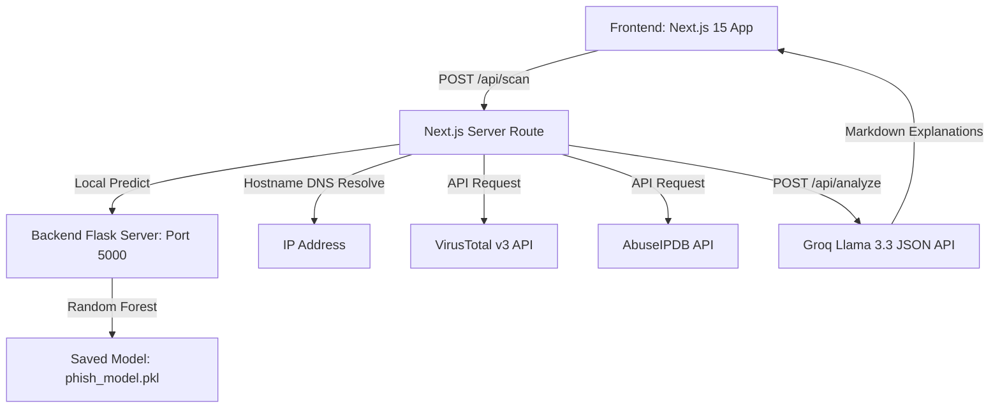

# AI Phishing Detection Web App

A professional, enterprise-grade multi-layer URL scanner and AI-powered phishing detection platform. The system combines local **Machine Learning predictions**, **lexical heuristic heuristics**, **third-party threat intelligence blacklists**, and **Llama 3 AI security analysis** to deliver explainable, real-time threat verdicts.

**🌐 Live Demo:** [ai-phishing-detection-web-app-fn8k-ten.vercel.app](https://ai-phishing-detection-web-app-fn8k-ten.vercel.app/)

---

##  Key Features

*   **Multi-Stage Pipeline**: Real-time pipeline visualizer showing progress across the URL Parser, local ML Engine, and Threat DB.
*   **Local Machine Learning Classifier**: A Random Forest model trained on balanced clean/phishing datasets using character n-gram TF-IDF vectorization.
*   **Third-Party Threat Intel**:
    *   **VirusTotal API (v3)**: Queries global security engine detection flags.
    *   **AbuseIPDB API**: Resolves URL hostname to IP addresses and queries the IP abuse confidence score.
*   **Deep AI security explanations**: Integrated with **Groq Cloud (Llama 3.3)** to produce factual, structured JSON explanations with inline highlighted key metrics.
*   **Digital Highlighter UI**: Custom React parser that automatically renders critical threat words and findings in glowing emerald badges.

---

## Architecture



---

## ⚙️ Project Setup

### 1. Prerequisites
Ensure you have the following installed:
*   **Node.js** (v18+)
*   **Python** (3.8+)
*   **Package Managers**: `npm` and `pip`

---

### 2. Backend Setup (Flask & ML Engine)

1. Navigate to the `backend` directory:
   ```bash
   cd backend
   ```
2. Install Python dependencies:
   ```bash
   pip install flask flask-cors pandas scikit-learn joblib
   ```
3. Start the Flask server:
   ```bash
   python app.py
   ```
   *The server runs locally at `http://127.0.0.1:5000`.*

---

### 3. Frontend Setup (Next.js App)

1. Navigate to the `frontend` directory:
   ```bash
   cd frontend
   ```
2. Install npm dependencies:
   ```bash
   npm install
   ```
3. Create a `.env.local` file in the `frontend` root directory:
   ```env
   GROQ_API_KEY=your_groq_api_key
   VIRUSTOTAL_API_KEY=your_virustotal_api_key
   ABUSEIPDB_API_KEY=your_abuseipdb_api_key
   ```
4. Start the development server:
   ```bash
   npm run dev
   ```
   *Open `http://localhost:3000` in your web browser.*

---

##  Model Training Pipeline

You can retrain or update the classifier model at any time with custom URL lists:

1. **Place Data**: Add your URL dataset in `backend/data/all_urls.csv` (CSV format with `url` and `label` columns).
2. **Run Training Script**:
   ```bash
   cd backend
   ```
   ```bash
   python train.py
   ```
3. **What this does**:
   *   Processes input data and automatically balances dataset classes (generates clean URLs to match phishing samples).
   *   Fits a `TfidfVectorizer` (capturing character n-grams from length 3 to 5).
   *   Trains a `RandomForestClassifier` (150 estimators, max depth 30).
   *   Evaluates accuracy (current performance: **92.5% accuracy**).
   *   Overwrites `backend/models/phish_model.pkl` and `backend/data/vectorizer.pkl`.
4. **Deploy**: Restart the Flask server (`python app.py`) to load the newly trained weights.

---
